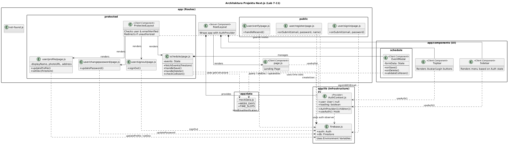

## Laboratorium Frameworki Frontendowe (Next.js)

Projekt zaliczeniowy realizowany w ramach przedmiotu "Frameworki Frontendowe", obejmujący Laboratoria 7-11. Aplikacja została zbudowana w oparciu o Next.js (App Router) i Firebase, implementując pełny system autoryzacji oraz interaktywny planer zajęć.

### Wersja live

Aplikacja jest wdrożona i dostępna pod adresem:
https://frontend-frameworks-lab-nextjs.vercel.app

### Technologie

- Framework: Next.js 16 (App Router)
- Język: JavaScript (ES6+)
- Stylizacja: Tailwind CSS
- Backend / Baza Danych: Firebase (Authentication, Firestore)
- Formularze: React Hook Form
- Testy E2E: Playwright
- Deployment: Vercel

## Realizacja laboratoriów

Projekt powstawał iteracyjnie, a postępy prac zostały odzwierciedlone w historii Git poprzez dedykowane branche.

### Laboratorium 7: Setup i struktura

- Zainicjowałem projekt Next.js z App Routerem.
- Skonfigurowałem połączenie z Firebase przy użyciu zmiennych środowiskowych.
- Stworzyłem AuthContext do zarządzania stanem zalogowania.
- Zaprojektowałem podział na strefy publiczne (public) i chronione (protected) z wykorzystaniem Layoutów i Middleware (w formie useLayoutEffect).

### Laboratorium 8: Autoryzacja i profil

- Zaimplementowałem pełny cykl życia użytkownika: Rejestracja -> Weryfikacja Email -> Logowanie -> Profil -> Wylogowanie.
- Dodałem blokadę dostępu dla niezweryfikowanych adresów email.
- Stworzyłem formularze edycji profilu (zmiana displayName i photoURL) oraz zmiany hasła.

### Laboratorium 9: Baza danych (Firestore)

- Podłączyłem bazę Firestore do przechowywania danych użytkownika (adres w profilu) oraz harmonogramu.
- Skonfigurowałem Reguły Bezpieczeństwa (Security Rules), aby użytkownik miał dostęp tylko do swoich danych.
- Zaimplementowałem pobieranie i zapisywanie danych w komponencie ProfilePage oraz SchedulePage.

### Laboratorium 10: Testy E2E

- Skonfigurowałem środowisko Playwright.
- Napisałem testy weryfikujące poprawność nawigacji oraz zabezpieczeń (przekierowanie niezalogowanego użytkownika).
- Zintegrowałem testy z GitHub Actions (CI/CD).

### Laboratorium 11: Wdrożenie i optymalizacja

- Naprawiłem błędy budowania (Build Errors) poprzez dodanie <Suspense> dla komponentów używających useSearchParams.
- Zaktualizowałem zależności (Next.js) w odpowiedzi na alerty bezpieczeństwa (CVE).
- Wdrożyłem aplikację na platformę Vercel.

## Funkcjonalność projektu (Temat 2: Planer)

Główną funkcjonalnością aplikacji jest Interaktywny Planer Zajęć.

- Widok: Tygodniowa siatka godzinowa.
- CRUD: Możliwość dodawania, edycji i usuwania zajęć.
- Walidacja: System wykrywa kolizje terminów (nie pozwala dodać zajęć w tym samym czasie).
- UX: Dynamiczne renderowanie wysokości kafelków w zależności od czasu trwania zajęć (np. 1.5h).

## Kluczowe decyzje projektowe i odstępstwa

Podczas realizacji projektu podjąłem kilka świadomych decyzji architektonicznych, ulepszając rozwiązania sugerowane w instrukcjach:

### Wylogowanie (Lab 8)

- Instrukcja: Sugerowała stworzenie formularza z przyciskiem "Wyloguj".

- Moje rozwiązanie: Zaimplementowałem automatyczne wylogowanie po wejściu na ścieżkę /user/signout. Jest to bezpieczniejsze i wygodniejsze dla użytkownika (można wylogować się jednym kliknięciem w menu).

### Weryfikacja email (Lab 8)

- Instrukcja: Sugerowała prosty komunikat o braku weryfikacji.

- Moje rozwiązanie: Rozbudowałem stronę /user/verify o przycisk "Wyślij ponownie link" oraz możliwość ręcznego powrotu do logowania. Rozwiązuje to problem utknięcia użytkownika w martwym punkcie, gdy mail nie dotrze.

### Komponenty UI

- Zamiast kopiować gotowy kod "1:1" z bibliotek, stworzyłem własne, reużywalne komponenty (Sidebar, Topbar, EventModal) oparte na klasach Tailwind CSS, co dało mi pełną kontrolę nad responsywnością i wyglądem.

## Uruchomienie lokalne

Aby uruchomić projekt na własnym komputerze, potrzebujesz pliku .env.local z kluczami Firebase.

Sklonuj repozytorium:

```
git clone https://github.com/MateuszCaputa/frontend-frameworks-lab-nextjs.git
```

```
cd frontend-frameworks-lab-nextjs
```

Zainstaluj zależności:

```
npm install
```

Skonfiguruj środowisko:
Utwórz plik .env.local i dodaj klucze Firebase:

```
NEXT_PUBLIC_API_KEY=""
NEXT_PUBLIC_AUTH_DOMAIN=""
NEXT_PUBLIC_PROJECT_ID=""
...
```

Uruchom serwer:

```
npm run dev
```

## Architektura

Poniżej znajduje się diagram klas i komponentów obrazujący strukturę aplikacji:



Diagram wygenerowany przy użyciu PlantUML. Źródło dostępne w pliku docs/project_uml.puml.
